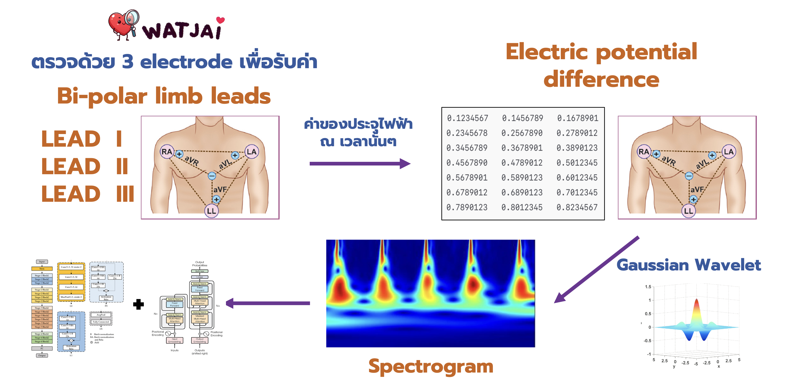
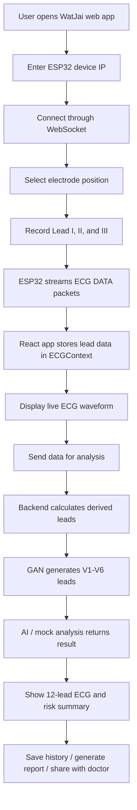

# WatJai

<p align="center">
  
</p>

<h3 align="center">AI-powered heart disease screening platform with ECG acquisition, 12-lead visualization, and analysis support</h3>

<p align="center">
  <strong>🥈 2nd Place — NSC 2025 National Competition</strong><br />
  Awarded 50,000 THB<br />
  <strong>🏆 Thailand Innovation Award 2024</strong>
</p>

---

## Overview

**WatJai** is an ECG-based medical AI prototype for heart disease screening. The system combines a hardware ECG device, a React web application, and a Python analysis backend to help users record ECG signals, visualize waveforms, generate derived leads, review analysis results, and share records for medical follow-up.

The project is designed as an accessible screening workflow:

- Capture ECG signals from an ESP32-based device
- Stream ECG data to the web app through WebSocket
- Record Lead I, Lead II, and Lead III
- Calculate derived ECG leads and visualize up to 12 leads
- Run AI-supported analysis and show risk-oriented results
- Save measurement history and prepare reports for doctor review

> WatJai is a research and innovation prototype. It is not intended to replace professional medical diagnosis, emergency care, or certified ECG equipment.

---

## Preview

### System Diagram



---

## Key Features

- **ECG device connection**
  - Connects to an ESP32 ECG device over WebSocket
  - Stores device IP in browser local storage
  - Sends commands such as `START`, `STOP`, `LEAD:<number>`, `PROCESS`, and `PING`
  - Handles reconnect attempts and heartbeat messages

- **Real-time ECG recording**
  - Records Lead I, Lead II, and Lead III
  - Displays live ECG waveform charts with Chart.js
  - Uses a 10-second recording flow for each lead
  - Detects lead-off status from the device

- **12-lead ECG reconstruction**
  - Uses measured leads to derive limb leads such as III, aVR, aVL, and aVF
  - Supports GAN-based generation of V1-V6 precordial leads in the Python backend
  - Includes sample ECG CSV files for fallback/demo visualization

- **AI analysis workflow**
  - Includes model assets under `model/`
  - Frontend service supports mock analysis and backend API analysis modes
  - Existing documentation reports ResNet-50 as the best model with 86.6% average accuracy

- **Patient-facing web experience**
  - Home dashboard with health metrics
  - Electrode placement guide
  - ECG measurement page
  - Results and 12-lead visualization page
  - Measurement history stored in local storage
  - Report sharing and PDF-oriented workflow
  - Telemedicine consultation prototype

- **ESP32 device display**
  - Uses TFT display for ECG monitor UI
  - Shows connection state, current lead, measurement status, ECG grid, processing animation, and lead-off warning

---

## End-to-End Workflow


---

## Hardware Flow

The device code is in:

```text
WatJai_Device.cpp
```

Main hardware responsibilities:

| Component | Purpose |
| --- | --- |
| ESP32 | Wi-Fi connection and WebSocket server |
| AD8232 | ECG signal acquisition |
| TFT display | Local ECG monitor and status interface |
| SPIFFS | Serves static files from the device when needed |

### Device Commands

| Command | Meaning |
| --- | --- |
| `START` | Start ECG measurement |
| `STOP` | Stop measurement and save current lead |
| `LEAD:1` | Select Lead I |
| `LEAD:2` | Select Lead II |
| `LEAD:3` | Select Lead III |
| `PROCESS` | Show processing state |
| `RESULT` | Show result-ready state |
| `PING` | Heartbeat check |

### Device Data Packet

The ESP32 streams ECG samples in batches:

```text
DATA:2048,2052,2061,2070,...
```

The frontend parses these packets and renders the waveform in real time.

---

## Backend API

The backend prototype is implemented in:

```text
main.py
```

### `POST /analyze`

Receives ECG signals and returns calculated leads plus analysis output.

Example request:

```json
{
  "signal_lead1": [2048, 2050, 2060],
  "signal_lead2": [2100, 2110, 2120],
  "sampling_rate": 500
}
```

Main backend steps:

1. Calculate limb leads: I, II, III, aVR, aVL, aVF
2. Generate V1-V6 using the GAN model when available
3. Run analysis logic
4. Return ECG lead data and analysis result

### `GET /get-record/<record_name>`

Loads ECG records using WFDB format and returns selected leads.

---

## Frontend Routes

| Route | Page |
| --- | --- |
| `/` | Home dashboard |
| `/electrode-position` | Electrode placement guide |
| `/measure` | ECG measurement page |
| `/results` | Analysis results and 12-lead ECG visualization |
| `/history` | Measurement history |
| `/telemedicine` | ECG sharing / telemedicine workflow |
| `/disclaimer` | Software disclaimer |

---

## Tech Stack

| Layer | Tools |
| --- | --- |
| Frontend | React, React Router, React Bootstrap |
| Charts | Chart.js, React Chart.js 2 |
| Data Parsing | PapaParse |
| Realtime Device Communication | WebSocket |
| Backend | Flask, Flask-CORS |
| AI / Signal Processing | TensorFlow, Keras, NumPy, WFDB |
| Hardware | ESP32, AD8232 ECG sensor, TFT_eSPI |
| Storage | Browser localStorage |

---

## Repository Structure

```text
.
|-- README.md
|-- WatJai_Device.cpp
|-- main.py
|-- package.json
|-- package-lock.json
|-- model/
|   |-- model.keras
|   `-- generator.weights.h5
|-- Spectrogram/
|   |-- lead_I.png
|   |-- lead_II.png
|   `-- ...
|-- public/
|   |-- images/
|   |   |-- watjai_logo.jpg
|   |   |-- lead-I-placement.png
|   |   |-- lead-II-placement.png
|   |   `-- lead-III-placement.png
|   |-- data/
|   |   `-- ecg_12lead_10s.csv
|   `-- manifest.json
`-- src/
    |-- App.js
    |-- context/
    |   `-- ECGContext.js
    |-- components/
    |   |-- Header.js
    |   `-- ECGChart.js
    |-- pages/
    |   |-- HomePage.js
    |   |-- ElectrodePositionPage.js
    |   |-- MeasurementPage.js
    |   |-- ResultsPage.js
    |   |-- HistoryPage.js
    |   |-- TelemedicinePage.js
    |   `-- DisclaimerPage.js
    `-- services/
        |-- WebSocketService.js
        |-- ApiService.js
        |-- ECGSharingService.js
        |-- EmailService.js
        `-- TelemedWebSocketService.js
```

---

## Quick Start

### 1. Install frontend dependencies

```bash
npm install
```

### 2. Start the React app

```bash
npm start
```

Open:

```text
http://localhost:3000
```

---

## ESP32 Setup

1. Open `WatJai_Device.cpp` in Arduino IDE or PlatformIO.
2. Install required libraries:
   - `ESPAsyncWebServer`
   - `AsyncTCP`
   - `TFT_eSPI`
3. Update Wi-Fi credentials in the device file.
4. Upload the firmware to the ESP32.
5. Open Serial Monitor and find the ESP32 IP address.
6. Enter that IP address in the WatJai web app.

For public repositories, move private Wi-Fi credentials out of the source code before publishing.

---

## Available Scripts

| Command | Description |
| --- | --- |
| `npm start` | Runs the React app in development mode |
| `npm test` | Runs the test watcher |
| `npm run build` | Builds the production app into `build/` |
| `npm run eject` | Ejects Create React App configuration |

---

## Award

**🥈 2nd Place — NSC 2025 National Competition**  
**Awarded 50,000 THB**

**🏆 Thailand Innovation Award 2024**

---

## License

This project is intended to be released under the **MIT License**.
